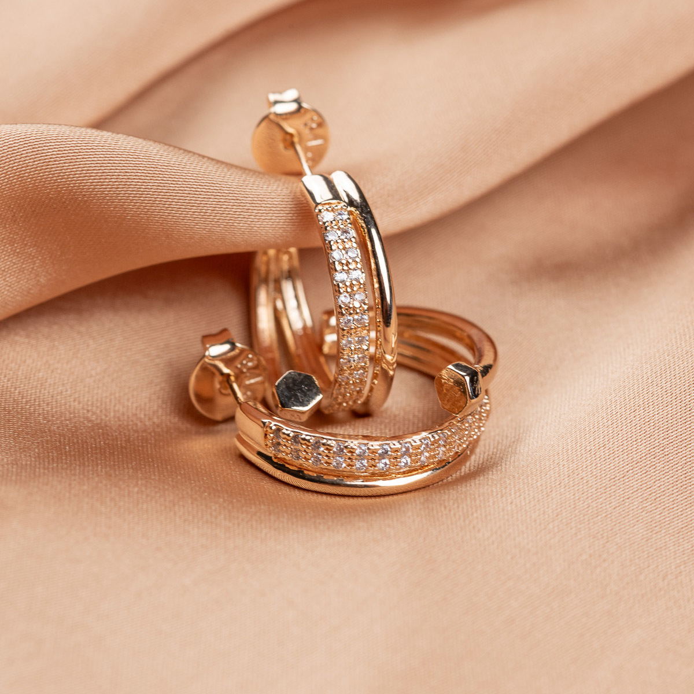
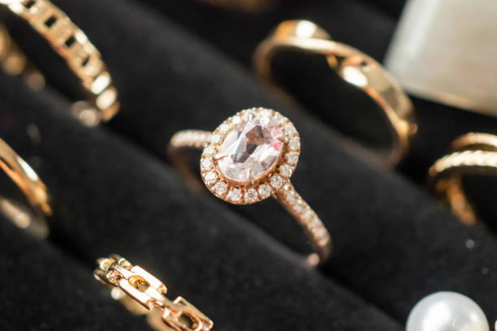

# Site-de-vendas-
<!DOCTYPE html>
<html>
<head>
  <title>Catálogo de Produtos</title>
  <link rel="stylesheet" href="style.css">
</head>
<body>
  <header>
    

      
    

  </header>
  <main>
    <h1>Nossos Produtos</h1>
    

      

        
        <h2>Produto 1</h2>
        
Descrição do produto 1, um produto incrível!

        
Preço: R$ 100,00

        <button>Comprar agora</button>
      

      

        
        <h2>Produto 2</h2>
        
Descrição do produto 2, outro produto fantástico!

        
Preço: R$ 200,00

        <button>Comprar agora</button>
      

      

        
        <h2>Produto 3</h2>
        
Descrição do produto 3, um produto que você vai adorar!

        
Preço: R$ 300,00

        <button>Comprar agora</button>
      

    

  </main>
  <footer>
    
&copy; 2025 Catálogo de Produtos

  </footer>
</body>
</html>
 
